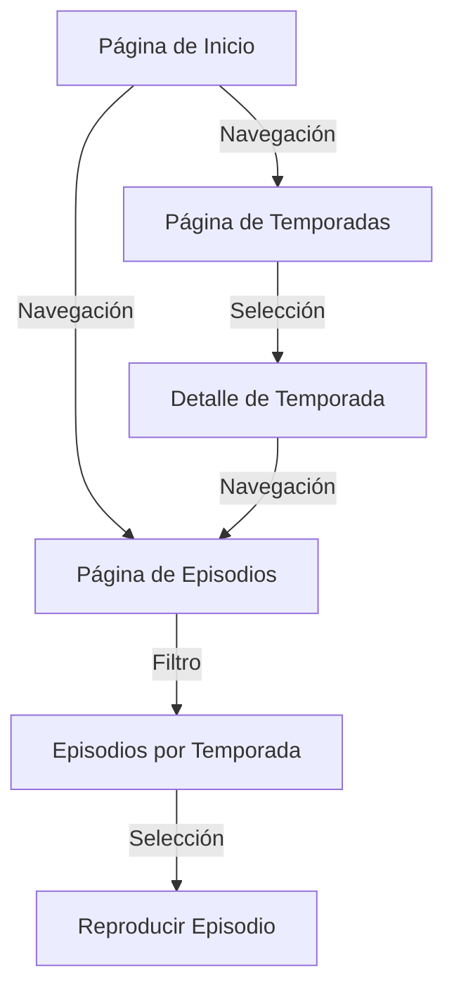
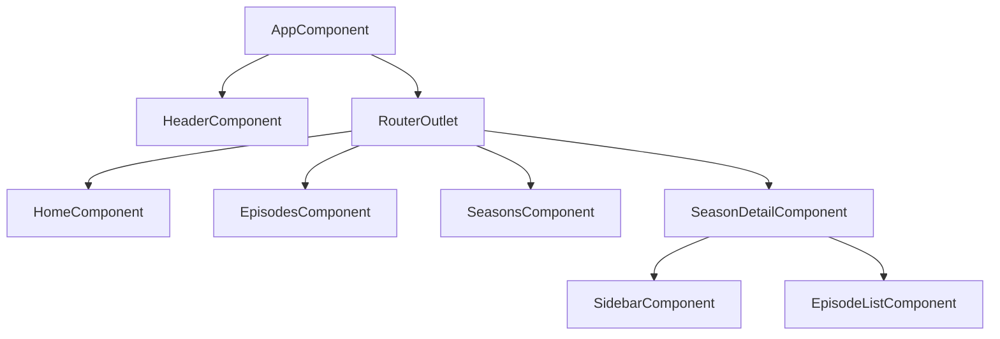

# Squid Game Series - Angular Project Documentation

## Descripción del Proyecto
Este proyecto es una aplicación web Angular que gestiona y muestra información sobre la serie "El Juego del Calamar". Proporciona una interfaz intuitiva para explorar temporadas, episodios y detalles de la serie, con características como navegación por temporadas, búsqueda y visualización de episodios.

## Arquitectura Angular
El proyecto sigue una estructura modular de componentes Angular:

```
src/
├── app/
│   ├── core/
│   │   ├── services/
│   │   │   ├── data.service.ts
│   │   │   ├── navigation.service.ts
│   │   │   └── ...
│   │   └── models/
│   │       ├── episode.model.ts
│   │       ├── season.model.ts
│   │       └── ...
│   ├── shared/
│   │   ├── components/
│   │   │   ├── header/
│   │   │   ├── sidebar/
│   │   │   └── ...
│   │   └── pipes/
│   │       └── safe-url.pipe.ts
│   ├── features/
│   │   ├── home/
│   │   ├── episodes/
│   │   ├── seasons/
│   │   └── season-detail/
│   ├── app-routing.module.ts
│   ├── app.component.ts
│   └── app.module.ts
├── assets/
│   └── images/
└── environments/
```

## Diagrama de Flujo de la Aplicación


## Componentes Principales

### 1. AppComponent
Componente raíz que maneja la estructura principal de la aplicación.

**Funcionalidades:**
- Proporciona el contenedor principal de la aplicación
- Incluye el componente de encabezado
- Maneja el área de contenido dinámico con `<router-outlet>`

### 2. HeaderComponent
Componente reutilizable para el encabezado de navegación.

**Características:**
```html
<header class="flex items-center justify-between border-b px-10 py-3">
  <div class="flex items-center gap-4">
    <!-- Logo -->
    <svg viewBox="0 0 48 48">...</svg>
    <h2>Squid Game</h2>
  </div>
  <div class="flex flex-1 justify-end gap-8">
    <!-- Menú de navegación -->
    <nav class="flex items-center gap-9">
      <a routerLink="/seasons">Temporadas</a>
      <a routerLink="/episodes">Episodios</a>
    </nav>
    <!-- Botones de acción -->
    <button (click)="search()">🔍</button>
    <button (click)="openProfile()">👤</button>
  </div>
</header>
```

**Servicios relacionados:**
- `NavigationService` para manejar rutas
- `SearchService` para funcionalidad de búsqueda

### 3. HomeComponent
Página principal con la presentación de la serie.

**Funcionalidades:**
- Muestra banner principal con imagen de fondo
- Botón "Ver ahora"
- Diseño responsivo con Tailwind CSS

```typescript
export class HomeComponent {
  backgroundImage = 'linear-gradient(rgba(0,0,0,0.1), url("...")';
  
  watchNow() {
    this.router.navigate(['/episodes']);
  }
}
```

### 4. SeasonsComponent
Listado de todas las temporadas disponibles.

**Estructura:**
```html
<div class="grid grid-cols-[repeat(auto-fit,minmax(158px,1fr))] gap-3">
  <div *ngFor="let season of seasons" class="flex flex-col gap-3">
    <div 
      class="aspect-[3/4] bg-cover rounded-lg"
      [style.background-image]="'url(' + season.image + ')'">
    </div>
    <p>{{ season.title }}</p>
  </div>
</div>
```

**Servicios:**
- `DataService` para obtener la lista de temporadas

### 5. EpisodesComponent
Listado completo de episodios organizados por temporada.

**Características:**
- Agrupación por temporadas
- Diseño de tarjetas para cada episodio
- Información básica de cada episodio

```typescript
export class EpisodesComponent implements OnInit {
  episodesBySeason: {[season: string]: Episode[]} = {};

  ngOnInit() {
    this.dataService.getEpisodes().subscribe(episodes => {
      this.episodesBySeason = this.groupBySeason(episodes);
    });
  }
  
  private groupBySeason(episodes: Episode[]): {[key: string]: Episode[]} {
    // Lógica de agrupamiento
  }
}
```

### 6. SeasonDetailComponent
Detalle completo de una temporada específica.

**Componentes incluidos:**
- SidebarComponent para navegación entre temporadas
- Vista principal con información detallada
- Listado de episodios de la temporada

**Diseño:**
```html
<div class="flex">
  <app-sidebar></app-sidebar>
  
  <div class="flex-1">
    <div class="bg-cover min-h-80" [style.background-image]="season?.banner"></div>
    
    <div class="flex flex-col md:flex-row">
      <div class="w-full aspect-video bg-cover rounded-lg" 
           [style.background-image]="season?.poster"></div>
      
      <div class="flex-1">
        <h2>{{ season?.title }}</h2>
        <p>{{ season?.description }}</p>
      </div>
    </div>
  </div>
</div>
```

## Servicios Angular

### DataService
```typescript
@Injectable({ providedIn: 'root' })
export class DataService {
  private readonly apiUrl = 'https://api.squidgame.com';
  
  constructor(private http: HttpClient) {}
  
  getSeasons(): Observable<Season[]> {
    return this.http.get<Season[]>(`${this.apiUrl}/seasons`);
  }
  
  getEpisodes(): Observable<Episode[]> {
    return this.http.get<Episode[]>(`${this.apiUrl}/episodes`);
  }
  
  getSeasonDetail(id: string): Observable<Season> {
    return this.http.get<Season>(`${this.apiUrl}/seasons/${id}`);
  }
}
```

### NavigationService
```typescript
@Injectable({ providedIn: 'root' })
export class NavigationService {
  constructor(private router: Router) {}
  
  navigateToSeason(seasonId: string) {
    this.router.navigate(['/seasons', seasonId]);
  }
  
  navigateToEpisode(episodeId: string) {
    this.router.navigate(['/episodes', episodeId]);
  }
}
```

## Routing Configuration
```typescript
const routes: Routes = [
  { path: '', component: HomeComponent },
  { path: 'episodes', component: EpisodesComponent },
  { path: 'seasons', component: SeasonsComponent },
  { path: 'seasons/:id', component: SeasonDetailComponent },
  { path: '**', redirectTo: '' }
];

@NgModule({
  imports: [RouterModule.forRoot(routes)],
  exports: [RouterModule]
})
export class AppRoutingModule { }
```

## Diagrama de Componentes


## Características Técnicas

1. **Responsive Design**:
   - Uso de Tailwind CSS para diseño adaptable
   - Breakpoints para móviles, tablets y escritorio
   - Grid y Flexbox para layouts flexibles

2. **Optimización de Imágenes**:
   - Componente ImageLoader para carga diferida
   - Uso de WebP format para mejor rendimiento
   - Placeholders durante la carga

3. **Gestión de Estado**:
   - Servicios Reactivos con RxJS
   - Subjects para comunicación entre componentes
   - Almacenamiento en caché de datos

4. **Performance**:
   - Lazy Loading de módulos
   - Prefetching de rutas
   - Tree-shaking de componentes no utilizados
